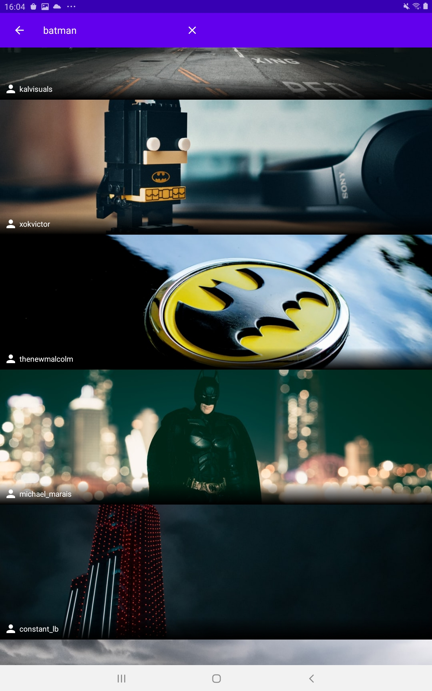

# Adonis-Gallery

## The Brief:

App that can search the Unsplash API for images and display them

## Libraries and architecture

 - MVVM architecture
 - Paging 3 
 - Glide 
 - Retrofit
 - Coroutines 
 - the Navigation Component 
 - View Binding 
 - Dagger Hilt.

